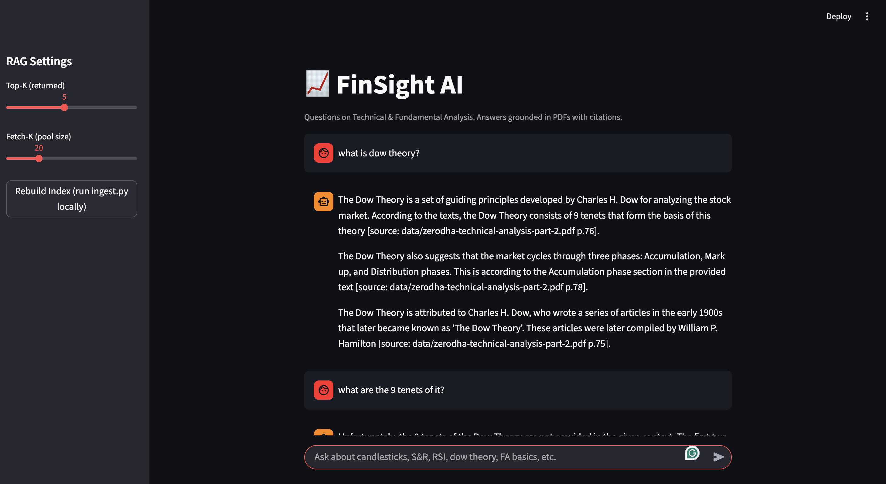
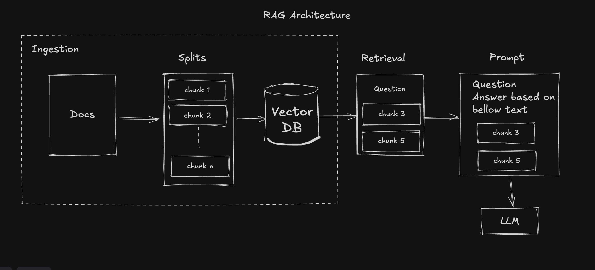

## FinSight AI — Finance RAG Chat

A Streamlit app that answers questions about Finance and Stock Trading PDFs using Retrieval-Augmented Generation (RAG). It indexes the PDFs locally with ChromaDB, embeds chunks using Hugging Face embeddings, retrieves relevant context for each query, and generates answers via Groq LLMs. The app includes conversational memory so it can reference the ongoing chat.



### Features

- **RAG over PDFs**: Uses `Chroma` vector store with persistent storage.
- **Embeddings**: `sentence-transformers/all-MiniLM-L6-v2` (CPU-friendly).
- **LLM**: Groq `llama-3.1-8b-instant` via `langchain-groq`.
- **Conversational memory**: `ConversationBufferMemory` maintains chat history in-session.
- **Citations**: Answers include source file and page numbers.

### Repository Layout

- `rag-app.py`: Streamlit app UI and orchestration.
- `ingest.py`: Parse, chunk, and index PDFs into ChromaDB.
- `prompts.py`: System and QA prompt with chat history placeholder.
- `utils.py`: Utilities for formatting retrieved documents and rendering a sources badge.
- `data/`: Input PDFs.
- `requirements.txt`: Python dependencies.

### Requirements

- Python 3.11 (recommended)
- macOS/Linux/Windows
- A Groq API key for LLM inference

### Quickstart

1. Clone and enter the project directory

```bash
git clone <your-fork-or-repo>
cd finance-chat
```

2. Create a virtual environment and activate it

```bash
python3 -m venv .venv
source .venv/bin/activate  # Windows: .venv\Scripts\activate
```

3. Install dependencies

```bash
pip install --upgrade pip
pip install -r requirements.txt
```

4. Set environment variables (create `.env` in the project root)

```bash
echo "GROQ_API_KEY=your_groq_api_key_here" > .env
echo "PERSIST_DIR=./chroma_db" >> .env
```

5. Ingest PDFs (build the vector index)

```bash
python ingest.py
```

6. Run the app

```bash
streamlit run rag-app.py
```

Open the printed local URL (typically http://localhost:8501).

### Environment Variables

- `GROQ_API_KEY` (required): Your Groq API key.
- `PERSIST_DIR` (optional): Directory where the ChromaDB index persists. Default: `./chroma_db`.

You can define these in `.env` or export them in your shell before running the app.

### Usage

1. Ensure the index is built (either run `ingest.py` or use the sidebar button to rebuild locally).
2. Ask questions about content in the PDFs (e.g., RSI, Dow Theory, support/resistance, basic FA).
3. The assistant answers with citations like `[source: <filename> p.<page>]`.
4. Conversation memory stays active during the session; a hard reload clears memory.

### How It Works (Architecture)



- `ingest.py` reads PDFs from `data/`, chunks them (recursive character splitter), computes embeddings, and writes to a `Chroma` collection (default name in code: `fianace-rag`).
- `rag-app.py` starts Streamlit, loads the persisted vector store as a retriever, and builds a chain:
  - Input: `{"question": ..., "chat_history": ...}`
  - `question` → retriever → top-k docs → `format_docs` to a single context string
  - Prompt: System + `chat_history` + Human (`question` + `context`)
  - LLM: `ChatGroq` with `llama-3.1-8b-instant`
  - Output: `StrOutputParser` → rendered text with citations
- `ConversationBufferMemory` stores the back-and-forth in `st.session_state.memory`.
